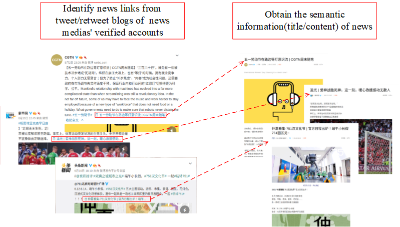
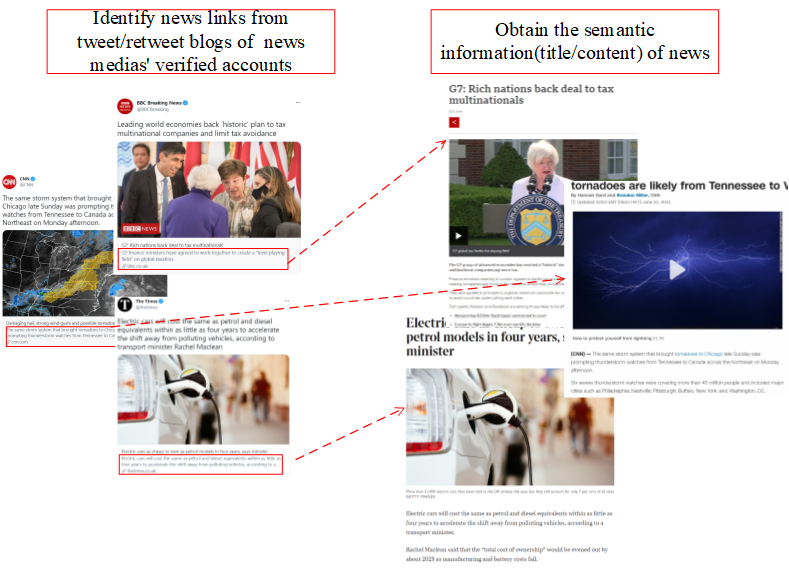

# IGNiteR: News Recommendation in Microblogging Applications

How the news is obtained from social media
---
- on weibo

- on twitter

For the execution of the news recommendation program, please first generate the node embeddings of users from influence graph, and integrate node embeddings 
with the recommendation data for user representation with weibo4IGNiteR.ipynb. All the original data needed in the notebook is available at [sina weibo](https://www.aminer.org/influencelocality).
In 'news_crawler', a script is given to crawl the news title and news content through the link provided in sina weibo root_content.txt.

Files description
---
  
- 'InfluenceGraph.py'
    - behaviour-driven Influence Graph Neural Network for node embedding

- 'weibo4IGNiteR.ipynb'
    - Data processing
    
- 'IGNiteR.py'
    - IGNiteR recommendation model
    
- 'utils.py'

- 'data'
    - news_crawler
    - train_set_sample.txt
    

Required packages
---
- tensorflow-gpu == 2.0.0
- Keras == 2.3.1
- graphviz == 0.14.1
- jieba == 0.42.1
- numpy == 1.19.4

